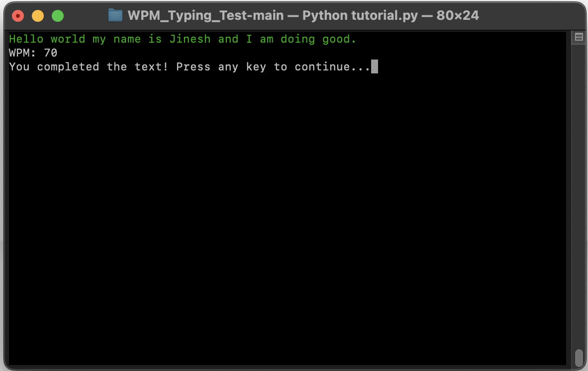

# TerminalTypeTest

TerminalTypeTest is a terminal-based typing test application that measures typing speed and accuracy. This Python application provides real-time feedback on Words Per Minute (WPM), error rate, and completion time, helping users improve their typing performance. Developed as a personal tool, TerminalTypeTest helped me boost my typing speed from 40 WPM to 70 WPM within one week.

## Demo

The application starts with a welcome screen and then moves into the typing test, where you type a randomly selected line of text. Your current WPM is displayed in real-time at the top of the screen. Once you finish typing the text, the app will notify you of completion.


## Features
- **WPM Calculation**: Tracks typing speed in real-time based on the number of words typed.
- **Error Detection**: Highlights mistakes as you type, with color-coded feedback for errors.
- **Completion Feedback**: Displays a message when the test is completed, encouraging the user to retry.
- **Randomized Texts**: Loads random text from a file to keep tests fresh and challenging.


## How It Works
The application uses the `curses` library to handle terminal output and real-time keypresses. It calculates the WPM based on the total characters typed, divided by 5 (the average word length), and measures this against elapsed time. Errors are shown in red, while correct letters are displayed in green.


## Installation
1. Clone the repository:
2. Navigate to the project directory:
3. Install necessary Python dependencies (if any):
   ```bash
   pip install -r requirements.txt
   ```
4. Run the application:
   ```bash
   python main.py
   ```

## Improvements
I used TerminalTypeTest to improve my own typing speed from 40 WPM to 70 WPM within just one week. It can serve as a fun and interactive tool for anyone looking to enhance their typing skills.